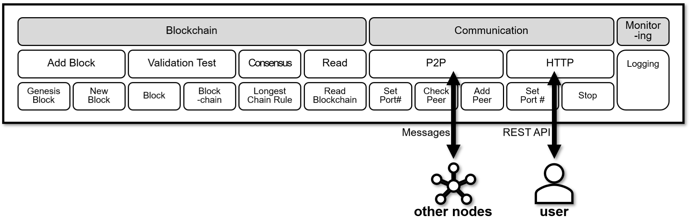

Inspired by [lhartikk/naivechain](https://github.com/lhartikk/naivechain).

---


```
$ npm install --save-dev @babel-node @babel/preset-env @babel/core
$ npx babel-node src/main.js
```

## onechain-explorer

[](https://github.com/lukepark327/onechain-explorer)

> Click on the above image to go to the `onechain-explorer` repo.

A **`onechain explorer`** is the front-end used to visualize the state of the blockchain. This blockchain explorer allows users to see the latest blocks and details about a particular block. onechain already has multiple functions with HTTP (RESTful API) endpoints. So the web page calls those endpoints and visualizes the results.

The full UI code is located in [lukepark327/onechain-explorer](https://github.com/lukepark327/onechain-explorer) repo. Vue.js and Vuetify are used.





# Docker Quick Start

```bash
docker run -it -p 3001:3001 -p 6001:6001 lukepark327/onechain
```

# How to Start

## Run Nodes

### Start node #1
```bash
npm start
```

### Start node #2

* Set `HTTP_PORT` for HTTP communication <br>
  ```gci env:``` or `set`

  ```$env:HTTP_PORT=3002```
  *or*
  ```export HTTP_PORT=3002```
  *or*
  `set HTTP_PORT=3002`

* Set `P2P_PORT` for P2P communication among peers

  ```$env:P2P_PORT=6002```
  *or*
  ```export P2P_PORT=6002```

* (*option*) Set pre-connected `PEERS` before running

  ```$env:PEERS="ws://127.0.0.1:6001[, ws://127.0.0.1:6003, ...]"```
  *or*
  ```export PEERS="ws://127.0.0.1:6001[, ws://127.0.0.1:6003, ...]"```

* (*option*) Set `PRIVATE_KEY` where private_key is located

  ```$env:PRIVATE_KEY="second"```
  *or*
  ```export PRIVATE_KEY="second"```

  Now private_key is located in `./wallet/second/` instead of default location `./wallet/default/`.

```bash
npm start
```

# How to Use

<p align="center">
  <a href="https://youtu.be/uBeUTRtgGxI">
    
  </a>
</p>

> Click on the above image to play the video.

### Get blockchain
```bash
curl http://127.0.0.1:3001/blocks
```

Use 'pretty-print JSON' for better readability:
```bash
curl http://127.0.0.1:3001/blocks | python -m json.tool
```
Python >= 2.6 is required.

### Get a particular block
```bash
curl http://127.0.0.1:3001/block/:number
```

For example, let us get a block whose number (index) is 3:

```bash
curl http://127.0.0.1:3001/block/3
```

### Add new block
```bash
curl -X POST http://127.0.0.1:3001/mineBlock
curl -H "Content-type:application/json" --data "{\"data\" : [\"Anything you want\", \"Anything you need\"]}" http://127.0.0.1:3001/mineBlock
curl -H "Content-Type: application/json" -d @../post_src/posttest.json http://127.0.0.1:3001/mineBlock
```

### Get current version
```bash
curl http://127.0.0.1:3001/version
```

### Get the version of particular block
```bash
curl http://127.0.0.1:3001/blockVersion/:number
```

For example, let's get a version of a block whose number (index) is 3:

```bash
curl http://127.0.0.1:3001/blockVersion/3
```

### Get connected peer(s)
```bash
curl http://127.0.0.1:3001/peers
```

### Add peer(s)
```bash
curl -H "Content-type:application/json" --data "{\"peers\" : [\"ws://127.0.0.1:6002\", \"ws://127.0.0.1:6003\"]}" http://127.0.0.1:3001/addPeers
```

### Get Address
```bash
curl http://127.0.0.1:3001/address
```

### Stop
```bash
curl -X POST http://127.0.0.1:3001/stop
```
